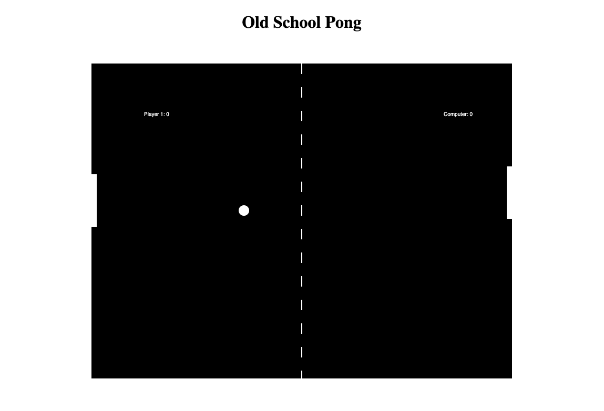

# Pong-Game

### This is a simple Pong Game built using HTML CSS and JavaScript
 
#### You can test the game [here](https://beethoven3579.github.io/Pong-Game/) 

## Project Summary
This game was built using a Udemy tutorial. I essentially used this as an introduction to game programming as well as a stepping stone to building
my snake game application. This was a very useful learning experience. I learned about how to make objects move and detect collisions. I learned about detecting mouse position during game play. I learned about basic draw methods such as fillStyle, beginPath, arc and fill. I also started to scratch the surface of very simple machine learning. 

## About Me
Nick Paolino -- Full-Time Programming Student -- [LinkedIn](https://www.linkedin.com/in/nick-paolino-00469291/)
